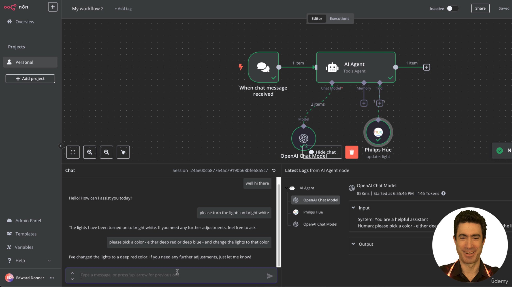
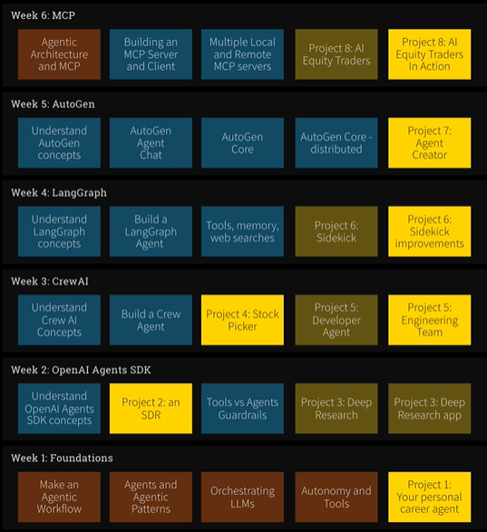

# Week 1

This week is all about 'Foundations'.

**Project1: Your personal career agent.**

## Day 1

### Lecture 1

This is a demo using [N8N](https://n8n.io/) to use chatbot to control smart home devices.

- Create a free account on N8N.
- On the open canvas, connect a chat prompt to an AI Agent.
- Select a model for the agent -- ex, OpenAI chat model.
- Provide the smart home device to control as the 'Tool' to the agent.
- Send a chat message to control the device.

### Lecture 2

What is the course actually about? Theory, Frameworks, Projects. The outline of the course and expectations in each week
is layed out.

### Lecture 3

Setup of environment -
- [Cursor](https://cursor.com/) - AI forward IDE based on VSCode.
- [UV Package Manager](https://docs.astral.sh/uv/) - Similar to Anaconda built on top of virtual
environments.

API costs - Given the use of LLM, we will incur API costs. Free alternatives such as Ollama might not produce
comparable results to OpenAI models for ex. See [pricing for OpenAI models](https://openai.com/api/pricing/).

### Lecture 4

Setting up environment for PC. See [this guide](../source_material/agents/README.md).
The lecture talks about cloning the repo, but I am using it as a submodule. After the setup
of the repo, install Cursor (NA - will use VSCode) and UV.

Installing `uv` steps taken -
- Installed using powershell as in [this guide](https://docs.astral.sh/uv/getting-started/installation/). Restart VSCode.
- Go to the `agents` subm directory.
- `uv sync`

OpenAI API
- 5 USD worth of credits has been paid for.
- A key for the project has been setup.

### Lecture 5

Setting up environment for

### Lecture 6

# Week 2

This week is all about 'OpenAI Agents SDK'.

**Project2: An SDR.**

**Project3: Deep Research and application.**

# Week 3

This week is all about 'CrewAI'.

**Project4: Stock Picker.**

**Project5: Developer Agent and Engineering Team.**

# Week 4

This week is all about 'LangGraph'.

**Project6: Sidekick - bring up a browser and interact alongside with us.**

# Week 5

This week is all about 'AutoGen'.

**Project7: Agent Creator - build an agentic framwork that generates agents.**

# Week 6

This week is all about 'MCP' (Model Concept Protocol).

**Project8: AI Equity Traders-.**
