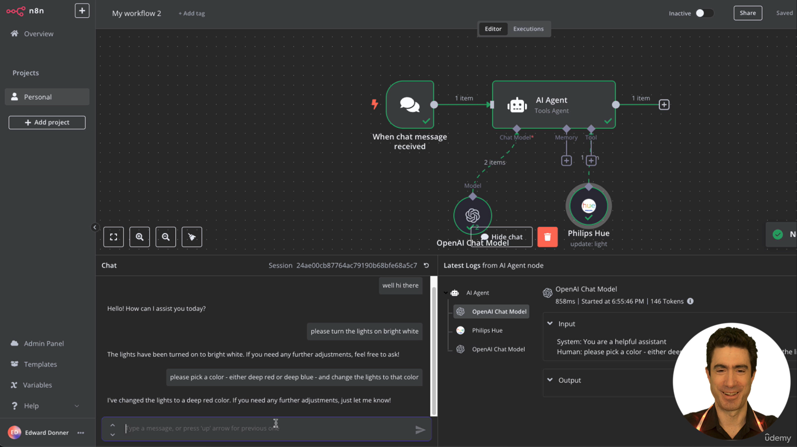

# Summary of Week 1

## Day 1

### Lecture 1
This is a demo using [N8N](https://n8n.io/) to use chatbot to control smart home devices.

- Create a free account on N8N.
- On the open canvas, connect a chat prompt to an AI Agent.
- Select a model for the agent -- ex, ChatGPT.
- Provide the smart home device to control as the 'Tool' to the agent.
- Send a chat message to control the device.
- See 

### Lecture 2
