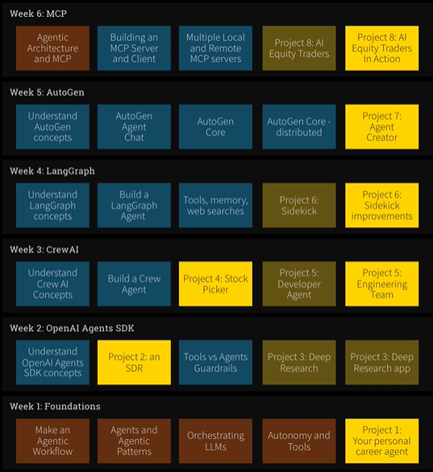
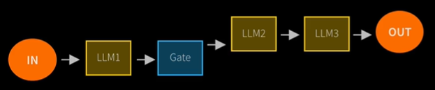
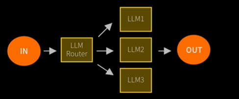
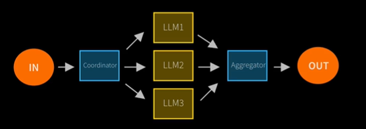
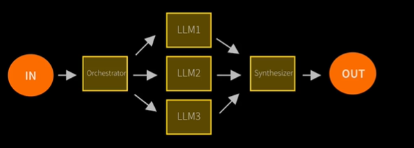
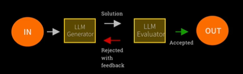
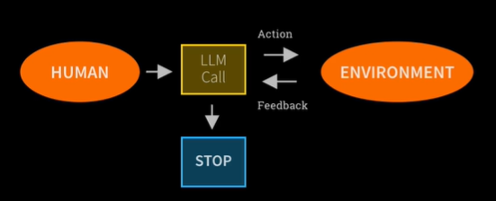

# Week 1

This week is all about 'Foundations'.

**Project1: Your personal career agent.**

## Day 1

### Lecture 1

This is a demo using [N8N](https://n8n.io/) to use chatbot to control smart home devices.

- Create a free account on N8N.
- On the open canvas, connect a chat prompt to an AI Agent.
- Select a model for the agent -- ex, OpenAI chat model.
- Provide the smart home device to control as the 'Tool' to the agent.
- Send a chat message to control the device.

### Lecture 2

What is the course actually about? Theory, Frameworks, Projects. The outline of the course and expectations in each week
is layed out.

### Lecture 3

Setup of environment -
- [Cursor](https://cursor.com/) - AI forward IDE based on VSCode.
- [UV Package Manager](https://docs.astral.sh/uv/) - Similar to Anaconda built on top of virtual
environments.

API costs - Given the use of LLM, we will incur API costs. Free alternatives such as Ollama might not produce
comparable results to OpenAI models for ex. See [pricing for OpenAI models](https://openai.com/api/pricing/).

### Lecture 4

Setting up environment for PC. See [this guide](../source_material/agents/README.md).
The lecture talks about cloning the repo, but I am using it as a submodule. After the setup
of the repo, install Cursor (NA - will use VSCode) and UV.

Installing `uv` steps taken -
- Installed using powershell as in [this guide](https://docs.astral.sh/uv/getting-started/installation/). Restart VSCode.
- Go to the `agents` subm directory.
- `uv sync`

OpenAI API
- Add 5 USD worth of credits, which apparently is enough for the course.
- Setup a key for the project.

### Lecture 5

Setting up environment for

### Lecture 6

- Create a `.env` file and add store the `OPENAI_API_KEY`.
- `cd source_material/agents`
- Also copy the `.env` file over from the root dir for using in the labs.
  - Can have symbolic links in Linux/Mac, but not in Windows.
- Open `1_lab1.ipynb`.
- Select the python interpreter from the `.venv` and since it is within the subm, we need to add the path to `.venv` in
  the "Python: Venv Path" setting of VSCode, in order to find the python executable in that path.
- Execute the cells of the notebook one at a time.
- Deviations from lecture -
  - Cells 8, 10 and 12: use the newer and cheaper `"gpt-5-nano"` instead of `"gpt-4.1-nano"`. Set this as the
    `OPENAI_MODEL` envvar.
- Execute the exercise as `uv run Week1/lab1_exercise.py`.

### Lecture 7

Closing statements for Day 1.

## Day 2

### Lecture 1

What is Agentic AI? Programs where LLM output controls the workflow. Common symptoms include - multiple LLM calls,
ability to use tools, an environment where LLMs interact, a certain degree of autonomy.

Anthropic discusses two patterns for Agentic AI -
- Workflows - have predefined code flows. NOTE: weird to refer to this as "agentic", but ...
- Agents - more autonomous.

### Lecture 2

5 Workflow Design Patterns defined by Anthropic.

NOTE: All blue boxes are user defined code.

#### 1. Prompt Chaining

Decompose an input requirement into a sequence of well defined tasks.
This is the pattern followed in `Week1/lab1_exercise.py`

#### 2. Routing

An input is taken by an LLM router which in-turn picks a "specialist" LLM that is best suited for the task.

#### 3. Parallelization

An input is broken down by user-defined code and the broken pieces are sent to several different LLMs to handle the
pieces in parallel. The outcome of the pieces is then aggregated to form the output.

#### 4. Orchestrator Worker

This is similar to the Parallelization pattern with the difference being that the breakdown of tasks is performed by the
LLM instead of user defined code.

#### 5. Evaluator Optimizer

An LLM that generates a solution and a second LLM that plays the role of an evaluator/validator that checks the
information and work performed by a prior LLM.

### Lecture 3

Agents in contrast to the Workflow design patterns, are typically open-ended, contain feedback loops,
and contain no fixed path. There are some concerns such as non-determinism in path taken, output given,
costs incurred. Monitoring and guardrails are essential.

## Day 3

### Lecture 1

# Week 2

This week is all about 'OpenAI Agents SDK'.

**Project2: An SDR.**

**Project3: Deep Research and application.**

# Week 3

This week is all about 'CrewAI'.

**Project4: Stock Picker.**

**Project5: Developer Agent and Engineering Team.**

# Week 4

This week is all about 'LangGraph'.

**Project6: Sidekick - bring up a browser and interact alongside with us.**

# Week 5

This week is all about 'AutoGen'.

**Project7: Agent Creator - build an agentic framwork that generates agents.**

# Week 6

This week is all about 'MCP' (Model Concept Protocol).

**Project8: AI Equity Traders-.**
